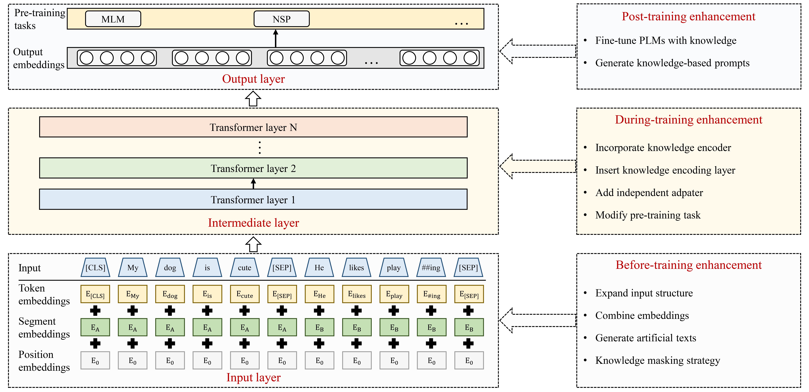

# Awesome-KGLLM
A collection of papers and resources about knowledge graph enhanced large language models (KGLLM)

Recently, ChatGPT, a representative large language model (LLM), has gained considerable attention due to its powerful emergent abilities. Some researchers suggest that LLMs could potentially replace structured knowledge bases like knowledge graphs (KGs) and function as parameterized knowledge bases. However, while LLMs are proficient at learning probabilistic language patterns based on large corpus and engaging in conversations with humans, they, like previous smaller pre-trained language models (PLMs), still have difficulty in recalling facts while generating knowledge-grounded contents. To overcome these limitations, researchers have proposed enhancing data-driven PLMs with knowledge-based KGs to incorporate explicit factual knowledge into PLMs, thus improving their performance to generate texts requiring factual knowledge and providing more informed responses to user queries. Therefore, we review the studies on enhancing PLMs with KGs, detailing existing knowledge graph enhanced pre-trained language models (KGPLMs) as well as their applications. Inspired by existing studies on KGPLM, we propose to enhance LLMs with KGs by developing knowledge graph-enhanced large language models (KGLLMs). KGLLM provides a solution to enhance LLMs' factual reasoning ability, opening up new avenues for LLM research.

The organization of these papers refers to our survey: [ChatGPT is not Enough: Enhancing Large Language Models with Knowledge Graphs for Fact-aware Language Modeling](https://arxiv.org/abs/2306.11489 "悬停显示")

Please let us know if you find any mistakes or have any suggestions by email: yangly@zhejianglab.com

If you find our survey useful for your research, please cite the following paper:
```bash
@article{KGLLM,
title={ChatGPT is not Enough: Enhancing Large Language Models with Knowledge Graphs for Fact-aware Language Modeling},
author={Yang, Linyao and Chen, Hongyang and Li, Zhao and Ding, Xiao and Wu, Xindong},
journal={arXiv preprint arXiv:2306.11489},
year={2023}
}
```

## Overview
In this repository, we collect recent advances in knowledge graph enhanced large language models. According to the stage at which KGs participate in pre-training, existing methods can be categorized into before-training enhancement, during-training enhancement, and post-training enhancement methods.



## Table of Contents

## Before-training Enhancement KGPLMs
### Expand Input Structures
- K-bert: Enabling language representation with knowledge graph (AAAI, 2020) [[paper]](https://ojs.aaai.org/index.php/AAAI/article/view/5681/5537)
- CoLAKE: Contextualized Language and Knowledge Embedding (COLING, 2020) [[paper]](https://aclanthology.org/2020.coling-main.327/)
- Cn-hit-it. nlp at semeval-2020 task 4: Enhanced language representation with multiple knowledge triples (SemEval, 2020) [[paper]](https://aclanthology.org/2020.semeval-1.60/)

### Enrich Input Information
- LUKE: Deep Contextualized Entity Representations with Entity-aware Self-attention (EMNLP, 2020) [[paper]](https://aclanthology.org/2020.emnlp-main.523/)
- E-BERT: Efficient-Yet-Effective Entity Embeddings for BERT (EMNLP, 2020) [[paper]](https://aclanthology.org/2020.findings-emnlp.71/)
- Knowledge-Aware Language Model Pretraining [[paper]](https://arxiv.org/abs/2007.00655)
- OAG-BERT: Towards a Unified Backbone Language Model for Academic Knowledge Services (KDD, 2022) [[paper]](https://dl.acm.org/doi/abs/10.1145/3534678.3539210)
- DKPLM: Decomposable Knowledge-enhanced Pre-trained Language Model for Natural Language Understanding (AAAI, 2022) [[paper]](https://ojs.aaai.org/index.php/AAAI/article/view/21425/21174)

### Generate New Data
- Align, Mask and Select: A Simple Method for Incorporating Commonsense Knowledge into Language Representation Models [[paper]](https://arxiv.org/abs/1908.06725)
- KGPT: Knowledge-Grounded Pre-Training for Data-to-Text Generation (EMNLP, 2020) [[paper]](https://aclanthology.org/2020.emnlp-main.697/)
- Barack's wife hillary: Using knowledge-graphs for fact-aware language modeling (ACL, 2019) [[paper]](https://aclanthology.org/P19-1598.pdf)
- Atomic: An atlas of machine commonsense for if-then reasoning (AAAI, 2019) [[paper]](https://ojs.aaai.org/index.php/AAAI/article/view/4160/4038)
- KEPLER: A Unified Model for Knowledge Embedding and Pre-trained Language Representation (TACL, 2021) [[paper]](https://aclanthology.org/2021.tacl-1.11.pdf)

### Optimize Word Masks
- ERNIE: Enhanced Language Representation with Informative Entities (ACL, 2019) [[paper]](https://aclanthology.org/P19-1139/)
- Pretrained Encyclopedia: Weakly Supervised Knowledge-Pretrained Language Model [[paper]](https://arxiv.org/abs/1912.09637)
- Exploiting Structured Knowledge in Text via Graph-Guided Representation Learning (EMNLP, 2020) [[paper]](https://aclanthology.org/2020.emnlp-main.722.pdf)

## During-training enhancement KGPLMs
### Incorporate Knowledge Encoders
- ERNIE: Enhanced Language Representation with Informative Entities (ACL, 2019) [[paper]](https://aclanthology.org/P19-1139/)
- ERNIE 3.0: Large-scale Knowledge Enhanced Pre-training for Language Understanding and Generation [[paper]](https://arxiv.org/abs/2107.02137)
- BERT-MK: Integrating Graph Contextualized Knowledge into Pre-trained Language Models (AI Open, 2021) [[paper]](https://www.sciencedirect.com/science/article/pii/S2666651021000188)
- JointLK: Joint Reasoning with Language Models and Knowledge Graphs for Commonsense Question Answering (NAACL, 2022) [[paper]](https://aclanthology.org/2022.naacl-main.372/)
- Knowledge-Enriched Transformer for Emotion Detection in Textual Conversations (EMNLP-IJCNLP, 2019) [[paper]](https://aclanthology.org/D19-1016/)
- Relational Memory-Augmented Language Models (TACL, 2022) [[paper]](https://aclanthology.org/2022.tacl-1.32/)
- QA-GNN: Reasoning with Language Models and Knowledge Graphs for Question Answering (NAACL, 2021) [[paper]](https://aclanthology.org/2021.naacl-main.45/)
- GreaseLM: Graph REASoning Enhanced Language Models for Question Answering [[paper]](https://arxiv.org/abs/2201.08860)
- KLMo: Knowledge graph enhanced pretrained language model with fine-grained relationships (EMNLP, 2021) [[paper]](https://aclanthology.org/2021.findings-emnlp.384.pdf)

### Insert Knowledge Encoding Layers
- K-bert: Enabling language representation with knowledge graph (AAAI, 2020) [[paper]](https://ojs.aaai.org/index.php/AAAI/article/view/5681/5537)
- CoLAKE: Contextualized Language and Knowledge Embedding (COLING, 2020) [[paper]](https://aclanthology.org/2020.coling-main.327/)
- Knowledge Enhanced Contextual Word Representations (EMNLP-IJCNLP, 2019) [[paper]](https://aclanthology.org/D19-1005/)
- JAKET: Joint Pre-training of Knowledge Graph and Language Understanding (AAAI, 2022) [[paper]](https://ojs.aaai.org/index.php/AAAI/article/view/21417/21166)
- KG-BART: Knowledge Graph-Augmented BART for Generative Commonsense Reasoning (AAAI, 2021) [[paper]](https://ojs.aaai.org/index.php/AAAI/article/view/16796/16603)

### Add Independent Adapters
- K-Adapter: Infusing Knowledge into Pre-Trained Models with Adapters (ACL-IJCNLP, 2021) [[paper]](https://aclanthology.org/2021.findings-acl.121.pdf)
- Common Sense or World Knowledge? Investigating Adapter-Based Knowledge Injection into Pretrained Transformers (DEELIO, 2020) [[paper]](https://aclanthology.org/2020.deelio-1.5/)
- Parameter-Efficient Domain Knowledge Integration from Multiple Sources for Biomedical Pre-trained Language Models (EMNLP, 2021) [[paper]](https://aclanthology.org/2021.findings-emnlp.325/)
- Commonsense knowledge graph-based adapter for aspect-level sentiment classification (Neurocomputing, 2023) [[paper]](https://www.sciencedirect.com/science/article/pii/S0925231223002229)

### Modify Pre-training Task
- SenseBERT: Driving Some Sense into BERT (ACL, 2020) [[paper]](https://aclanthology.org/2020.acl-main.423/)
- ERNIE: Enhanced Language Representation with Informative Entities (ACL, 2019) [[paper]](https://aclanthology.org/P19-1139/)
- LUKE: Deep Contextualized Entity Representations with Entity-aware Self-attention (EMNLP, 2020) [[paper]](https://aclanthology.org/2020.emnlp-main.523/)
- OAG-BERT: Towards a Unified Backbone Language Model for Academic Knowledge Services (KDD, 2022) [[paper]](https://dl.acm.org/doi/abs/10.1145/3534678.3539210)
- Pretrained Encyclopedia: Weakly Supervised Knowledge-Pretrained Language Model [[paper]](https://arxiv.org/abs/1912.09637)
- Exploiting Structured Knowledge in Text via Graph-Guided Representation Learning (EMNLP, 2020) [[paper]](https://aclanthology.org/2020.emnlp-main.722.pdf)
- ERICA: Improving Entity and Relation Understanding for Pre-trained Language Models via Contrastive Learning (ACL-IJCNLP, 2021) [[paper]](https://aclanthology.org/2021.acl-long.260/)
- SentiLARE: Sentiment-Aware Language Representation Learning with Linguistic Knowledge (EMNLP, 2020) [[paper]](https://aclanthology.org/2020.emnlp-main.567/)

## Post-training E
